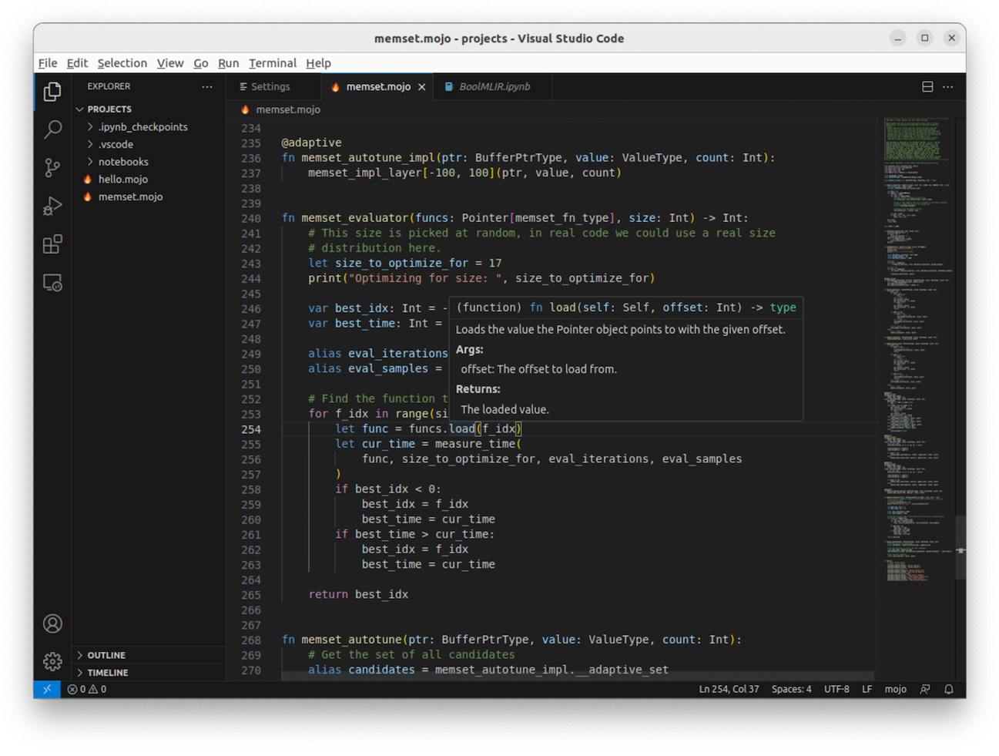

The Mojo SDK is currently available for Ubuntu Linux systems and macOS
systems running on Apple silicon. Support for Windows is
coming soon. You can also develop from Windows or Intel macOS using a container
or remote Linux system. Alternatively, you can also experiment with Mojo using
our web-based [Mojo Playground](#develop-in-the-mojo-playground).

## Get the Mojo SDK

:::note Deprecation Notice

The Mojo SDK is now included in the [MAX Developer
Edition](/engine/get-started/). To provide a complete toolkit with simple
dependencies, **the standalone Mojo SDK is now deprecated**. For now, you
can still download Mojo as a standalone package, but you will soon need to
instead install the `max` package to get the Mojo SDK.

:::

The Mojo SDK includes everything you need for local Mojo development, including
the Mojo standard library and the [Mojo command-line interface](/mojo/cli/)
(CLI). The Mojo CLI can start a REPL programming environment, compile and run
Mojo source files, format source files, and more.

We've also published a [Mojo extension for Visual Studio
Code](https://marketplace.visualstudio.com/items?itemName=modular-mojotools.vscode-mojo)
to provide a first-class developer experience with features like code
completion, quick fixes, and hover help for Mojo APIs.



### System requirements

To use the Mojo SDK, you need a system that meets these specifications:

Linux:

- Ubuntu 20.04/22.04 LTS
- x86-64 CPU (with [SSE4.2 or
  newer](https://www.intel.com/content/www/us/en/support/articles/000057621/processors.html))
  and a minimum of 8 GiB memory
- Python 3.8 - 3.11
- g++ or clang++ C++ compiler

Mac:

- Apple silicon (M1 or M2 processor)
- macOS Monterey (12) or later
- Python 3.8 - 3.11
- Command-line tools for Xcode, or Xcode

Support for Windows will be added in a future release.

### Install Mojo

1. Open a terminal and install the [`modular`](/cli/) command line tool:

    ```sh
    curl https://get.modular.com | sh -
    ```

2. Then sign in to your Modular account with this command:

    ```sh
    modular auth
    ```

3. Now you can install the Mojo SDK:

    ```sh
    modular install mojo
    ```

Next, get started with **[Hello, world!](hello-world.html)**

:::{.callout-note}

**Note:** To help us improve Mojo, we collect some basic system information and
crash reports. [Learn
more](/mojo/faq.html#does-the-mojo-sdk-collect-telemetry).

:::

### Update Mojo

Mojo is a work in progress and we will release regular updates to the
Mojo language and SDK tools. For information about each release, see the
[Mojo changelog](/mojo/changelog.html).

To check your current Mojo version, use the `--version` option:

```sh
mojo --version
```

To update to the latest Mojo version, use the `modular update` command:

```sh
modular update mojo
```

### Update the Modular CLI

We may also release updates to the `modular` tool. Run the following
commands to update the CLI on your system.

Linux:

```sh
sudo apt update

sudo apt install modular
```

Mac:

```sh
brew update

brew upgrade modular
```

## Develop in the Mojo Playground

Instead of downloading the Mojo SDK, you can also experiment with Mojo in our
hosted Jupyter notebook environment called Mojo Playground. This is a hosted
version of [JupyterLab](https://jupyterlab.readthedocs.io/en/latest/) that's
running our latest Mojo kernel.

To get access, just [log in to the Mojo Playground
here](https://playground.modular.com).


### What to expect

- The Mojo Playground is a [JupyterHub](https://jupyter.org/hub) environment in
which you get a private volume associated with your account, so you can create
your own notebooks and they'll be saved across sessions.

- We've included a handful of notebooks to show you Mojo basics and demonstrate
its capabilities.

- The number of vCPU cores available in your cloud instance may vary, so
baseline performance is not representative of the language. However, as you
will see in the included `Matmul.ipynb` notebook, Mojo's
relative performance over Python is significant.

- There might be some bugs. Please [report issues and feedback on
GitHub](https://github.com/modularml/mojo/issues/new/choose).

### Tips

- If you want to keep any edits to the included notebooks, **rename the notebook
files**. These files will reset upon any server refresh or update, sorry. So if
you rename the files, your changes will be safe.

- You can use `%%python` at the top of a notebook cell and write normal Python
code. Variables, functions, and imports defined in a Python cell are available
for access in subsequent Mojo cells.

### Caveats

- Did we mention that the included notebooks will lose your changes?<br/>
**Rename the files if you want to save your changes.**

- The Mojo environment does not have network access, so you cannot install
other tools or Python packages. However, we've included a variety of popular
Python packages, such as `numpy`, `pandas`, and `matplotlib` (see how to
[import Python modules](/mojo/manual/python/)).

- Redefining implicit variables is not supported (variables without a `let` or
`var` in front). If you’d like to redefine a variable across notebook cells,
you must introduce the variable with  `var` (`let` variables are immutable).

- You can’t use global variables inside functions—they’re only visible to
other global variables.

- For a longer list of things that don't work yet or have pain-points, see the
[Mojo roadmap and sharp edges](/mojo/roadmap.html).
